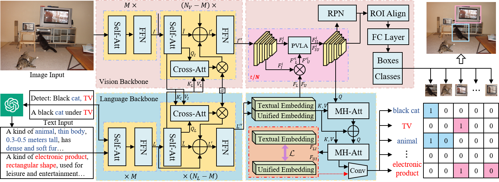

  <h1 align="center">UDL: Open Vocabulary Object Detection with LLM-based Unified Descriptive Language</h1>
  

     
    <strong>Chunlei Wang</strong></a>
    ·
    <strong>Wenquan Feng</strong></a>
    ·
    <strong>Binghao Liu</strong></a>
    ·
    <strong>Meng Li</strong></a>
    ·
    <strong>Lijiang Chen</strong></a>
    ·
    <strong>Qi Zhao</strong></a>
     
  

## Highlight!!!!

UDL: Open Vocabulary Object Detection with LLM-based Unified Descriptive Language

## Abstract

With the rapid development of vision-language approaches, more and more pioneers focus on the open vocabulary learning paradigm. These methods support a variety of vision-language tasks, aligning region features with language embeddings to enhance recognition ability of novel categories. However, existing methods neglect the diversity of input language in different tasks, which makes it difficult for the model to understand text context information and heavily rely on category names to detect objects. Capturing fine-grained features in images and text descriptions is also a challenge. To address these issues, we propose an Open Vocabulary Object Detection with LLM-based Unified Descriptive Language (UDL) with Hierarchical Gated Cross Attention (HGCA) and Pixel-level Visual Language Attention (PVLA) for more comprehensive contextual understanding and better visual-language alignment. On OminiLabel object detection benchmark, under the zero-shot detection setting, our approach can handle better open vocabulary object detection and achieve new SOTA results. Ablation studies and visualization experiments demonstrate the effectiveness of the proposed components. Codes will be publicly at
https://github.com/cv516Buaa/UDL.

## TODO
- [x] Release demo
- [x] Release checkpoints
- [ ] Release training and inference codes

## Checkpoints
* `UDL`:  | [Baidu Drive(pw: udll)](https://pan.baidu.com/s/1IHWS8_4yzR0SWvBp7qp9xw). |  [Google Drive](https://drive.google.com/file/d/1BhD1oWXddr6sb6SJdU0cRIpW91gfeDiU/view?usp=drive_link) |

## Citation

If you have any question, please discuss with me by sending email to wcl_buaa@buaa.edu.cn.
